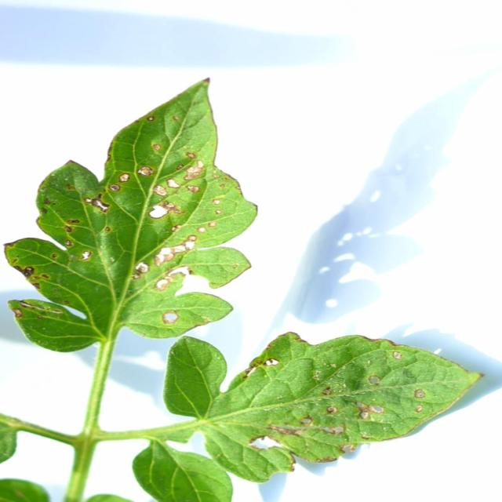

# YOLO for Early Detection of Tuta absoluta-Induced Tomato Leaf Diseases

[](https://doi.org/10.3389/fpls.2025.1524630)
**Published in:** Frontiers in Plant Science | [📄 Read Paper](https://www.frontiersin.org/journals/plant-science/articles/10.3389/fpls.2025.1524630/full)

## Overview
This repository contains the implementation for our paper **"YOLO for Early Detection and Management of Tuta absoluta-Induced Tomato Leaf Diseases"**, featuring:

- **TomatoEbola Dataset**: First annotated dataset of Tuta absoluta damage in Nigerian tomato farms (326 images, 784 annotations)
- **Optimized YOLOv8 Pipeline**: Real-time detection system for field deployment
- **Transfer Learning Framework**: Enhanced performance through model adaptation

 *(Replace with your example image)*
 | 

## Installation
1. Clone the repository:
```bash
git clone https://github.com/harisushehu/YOLO-for-detection-of-tomato-leaf-diseases.git
cd YOLO-for-detection-of-tomato-leaf-diseases
```

2. Install dependencies:
```bash
pip install -r requirements.txt
```

## Quick Start
1. Update dataset paths in YOLOv8.py (Line 70):
```bash
'data': './path_to_your_dataset/data.yaml'
```

2. Run detection:
```bash
python YOLOv8.py
```

## Dataset Structure
The TomatoEbola dataset follows this structure:

TomatoEbola/
├── train/
│   ├── images/
│   └── labels/
├── val/
│   ├── images/
│   └── labels/
└── data.yaml

## Usage Examples

Training
```bash
python YOLOv8.py 
```

## Citation

If you use this code or dataset in your research, please cite our paper:

```
@article{Shehu2025YOLOTuta,
  title={YOLO for Early Detection and Management of {Tuta absoluta}-Induced Tomato Leaf Diseases},
  author={Shehu, Harisu Abdullahi and Ackley, Aniebietabasi and Marvellous, Mark and Eteng, Ofem and Sharif, Md Haidar and Kusetogullari, Huseyin},
  journal={Frontiers in Plant Science},
  volume={16},
  pages={1524630},
  year={2025},
  publisher={Frontiers},
  doi={10.3389/fpls.2025.1524630},
  url={https://doi.org/10.3389/fpls.2025.1524630}
}
```

For any questions or inquiries, please contact: Harisu Shehu (harisushehu@ecs.vuw.ac.nz)

